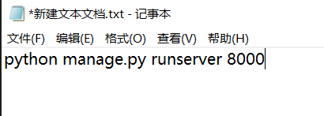

# 环境
<font color="FE0302">重要：新版本的Python和Django与该程序不兼容</font>
## Python解释器

Python 3.5版本

下载地址
- 32位：https://www.python.org/ftp/python/3.5.3/python-3.5.3.exe
- 64位：https://www.python.org/ftp/python/3.5.3/python-3.5.3-amd64.exe

## Django
1.10.6版本
使用以下命令安装
```bash
$ pip install Django==1.10.6
```
# 执行
## 批处理命令脚本
新建一个文本文档


将运行命令复制进去
```bash
python.exe .\manage.py runserver 8000
```

保存

将文件名后缀改为`.bat`


双击运行


## Powershell
将项目解压到本地文件夹

在`manage.py`所在路径下，同时按下`shift`和鼠标右键

点击**在此处打开Powershell窗口**


在console中输入
```bash
python.exe .\manage.py runserver 8000
```
若打印下列字段则表明成功运行


在浏览器地址栏输入
```bash
localhost:8000
```
即可成功运行

## 参考链接
- 原项目地址：https://github.com/Shuai-Xie/flight-ticket-booksystem
- 博客：https://www.jianshu.com/p/60a392df9f03
